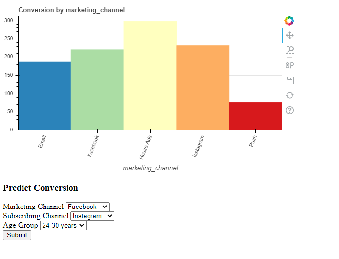
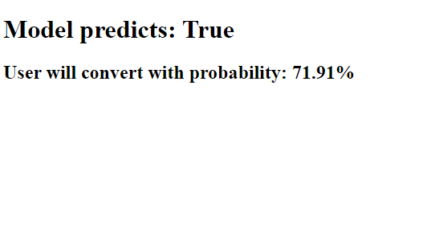

# Deployed Machine Learning Model
This model is served through an API I created using Flask. I deployed it on heroku, which you can view here: https://marketing-model.herokuapp.com/

The model predicts whether a user will convert in a marketing campaign. At the deploymed endpoint linked above, you can enter different values for the three features used to create the model (marketing channel, subscribing channel, and age group). 

The model will then predict on those inputs and output a probability estimate for the liklihood that a user with those features would convert. 

The code to create the model and serialize it can be found in model.py. It includes a pipeline to transform features (one hot encoding, imputing missing values) and a decision tree classifier to fit the data. This is then serialized via pickle. 

The Flask app is created in app.py. This app first handles input from the user and then deserializes the model to make predictions on it. 
This is what the deployment looks like: 

After submitting the input, the app uses the model to make a prediction and serves a response:

